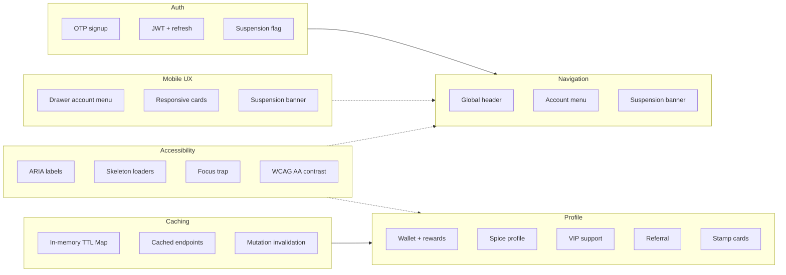

# Consumer Architecture

A consolidated, team-facing overview of the SnakZap consumer web app's
account, navigation, profile, caching, accessibility, and mobile-UX layers.
This document reflects the verified implementation as of the current session.

## Introduction

This document integrates the six architectural layers that shape the consumer
experience: authentication, navigation, profile, caching, accessibility, and
mobile UX. It is intended as a single reference for onboarding engineers,
reviewing changes, and keeping component boundaries consistent as the app grows.

Scope is limited to the consumer web application (`apps/consumer`) and the
shared UI package (`packages/ui`) it depends on. The backend contract it reads
from (`apps/api`) is referenced only where it defines runtime behavior.

## High-Level Diagram

Solid edges show data/state flow. Dashed edges show cross-cutting concerns that
apply across layers rather than flowing through a single path.

## Layer Descriptions

### Auth

- OTP signup with implicit sign-in on verification.
- JWT access token plus silent refresh via a refresh cookie.
- Suspension flag carried on the user payload and surfaced in the UI.

Backing code: `apps/api/src/routes/auth.ts`, `apps/consumer/lib/store.ts`.

### Navigation

- A global header rendered on every protected page.
- An account entry point that renders Sign in / Sign up for guests, an account
  menu for authenticated users, and a suspension banner when suspended.
- Sign-out is only reachable through the global account menu, never from page
  content such as checkout.

Backing code: `apps/consumer/components/AppHeader.tsx`,
`apps/consumer/components/AccountEntry.tsx`, `apps/consumer/middleware.ts`.

### Profile

- Wallet and rewards (balance, cashback history, pickup streak).
- Spice profile (optional heat tolerance, 1-5).
- VIP customer support (progress toward priority support).
- Referral (referral code, bonus, apply a friend's code).
- Stamp cards (progress toward a free item per restaurant).

Backing code: `apps/consumer/app/profile/page.tsx` and its section components.

### Caching

- In-memory `Map` with a 60 second TTL.
- Keys are `resource:token[:param]`, so entries never leak across users.
- Cached endpoints: wallet, streak (rewards), referral profile, stamp cards.
- Mutation invalidation on referral applied and order placed.

Backing code: `apps/consumer/lib/cache.ts`, `apps/consumer/lib/api.ts`,
`apps/consumer/app/checkout/page.tsx`.

### Accessibility

- ARIA labels and control wiring on icon-only and menu controls.
- Skeleton loaders using `role="status"` and `aria-busy`.
- Focus trap, Escape-to-close, and focus restore in the shared sheet dialog.
- WCAG AA contrast and 44px minimum touch targets.

Backing code: `packages/ui/src/Sheet.tsx`, `apps/consumer/components/AccountEntry.tsx`,
`apps/consumer/app/profile/page.tsx`, `apps/consumer/app/orders/page.tsx`.

### Mobile UX

- Account menu renders as a bottom-sheet drawer on mobile and a dropdown on
  desktop, via a responsive breakpoint hook.
- Responsive card grids collapse from multi-column to single/dual column.
- The suspension banner is fixed to the top of the viewport on all breakpoints.

Backing code: `apps/consumer/hooks/useMediaQuery.ts`,
`apps/consumer/components/AccountEntry.tsx`, `packages/ui/src/Sheet.tsx`.

## Cross-Cutting Concerns

- Auth drives Navigation: the account entry point reads the auth store and
  branches on token and suspension state.
- Caching backs Profile data: profile sections read through cached API helpers,
  and mutations invalidate the relevant cache prefixes.
- Accessibility and Mobile UX are cross-cutting: they apply to both Navigation
  and Profile rather than belonging to a single layer.
- The suspension banner is both an auth signal and a navigation/mobile concern,
  appearing consistently on every protected page.

## Component Boundaries

| Component | Responsibility |
| --- | --- |
| `apps/consumer/components/AppHeader.tsx` | Shared `BrandMark` and `AppHeader` (brand + account entry) |
| `apps/consumer/components/AccountEntry.tsx` | Guest links, account menu (dropdown/drawer), suspension banner |
| `apps/consumer/hooks/useMediaQuery.ts` | Responsive breakpoint detection |
| `apps/consumer/lib/cache.ts` | In-memory TTL cache and invalidation primitives |
| `apps/consumer/lib/api.ts` | API client; cached loyalty reads; mutation invalidation |
| `apps/consumer/lib/store.ts` | Zustand auth store (token, user, refresh, logout) |
| `packages/ui/src/Sheet.tsx` | Shared bottom-sheet dialog with focus trap |
| `apps/consumer/middleware.ts` | Protected-route matcher |

Page usage:

- `apps/consumer/app/page.tsx` uses `BrandMark` + `AccountEntry` directly
  (hero layout).
- `profile`, `orders`, `addresses`, and `checkout` (all states) use `AppHeader`.

## Verification & Tests

- Typecheck passes across all 8 packages (`api`, `consumer`, `vendor`, `admin`,
  `db`, `types`, `config`, `ui`).
- Consumer test suite: 118 tests passing.
- Vendor test suite: 20 tests passing.
- Backend (API) test suite: 511 tests passing.
- ESLint clean on all changed consumer files.
- Verified there are no loyalty reads that bypass the cache layer.

## Future Refinements

- Extend caching to remaining read-heavy endpoints (e.g. VIP status) or add
  stale-while-revalidate behavior.
- Reduce client bundle size via code-splitting and tree-shaking of large
  dependencies (e.g. `framer-motion`).
- Add per-route metadata for the remaining protected pages (profile, orders,
  checkout) to match the existing `addresses` layout metadata.
- Localize newly added UX copy (spice profile optional, standard-support
  reassurance) into Hindi.
- Add automated keyboard/assistive-technology regression coverage for the
  account drawer focus trap and focus restore.
